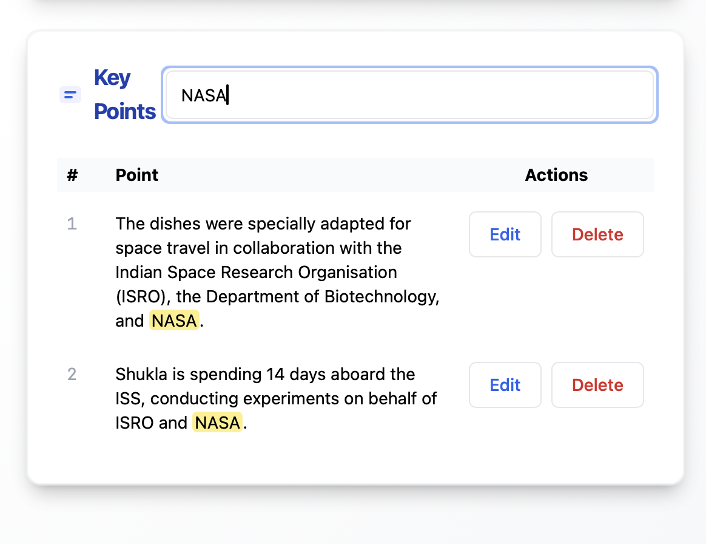

# AI-powered Content Extractor

A full-stack web app to extract, summarize, and display key points from any public URL using open-source NLP. Built with Java Spring Boot (backend), React.js + Next.js (frontend), Tailwind CSS, and shadcn/ui for a modern Notion-like UI. Features PDF export, inline editing, search, pagination, and more.

---

## ✨ Features
- Extracts main content from any public URL (removes nav/footer/ads, prefers main/article/largest/div)
- Summarizes content using open-source NLP (local or HuggingFace Inference API)
- Produces a 2–3 paragraph summary and key points based on the summary
- Notion-style editable/searchable key points table
- Inline editing and deletion of key points (with animation)
- Search with highlight and instant filtering
- Pagination for large lists of key points
- Export summary and key points as PDF (jsPDF)
- Modern, responsive UI (Tailwind CSS + shadcn/ui)
- Loading spinners, skeletons, and error toasts
- Fully tested (Jest, Testing Library, Maven)
- Vercel-deployable frontend, cloud-ready backend

## 🖼️ Screenshots

### Summary Extraction with PDF Export


### Key Points Table


### Key Points Search Functionality


### Key Points Edit Functionality


---

## 🛠️ Setup & Deployment

### 1. Backend (Spring Boot)
- **Requirements:** Java 17+, Maven
- **Setup:**
  ```sh
  cd backend
  mvn clean install
  ```
- **Run locally:**
  ```sh
  mvn spring-boot:run
  ```
- **Environment variables:**
  - `HUGGINGFACE_API_KEY` (optional, for better summaries)
- **API URL:**
  - By default: `http://localhost:8080/api/extract`

#### Deploy Backend (Recommended: Render)
- Push your code to GitHub.
- Go to [Render](https://render.com/), create a new Web Service, connect your repo, set build command to `./mvnw clean package` and start command to `java -jar target/<your-jar-file>.jar`.
- Set `HUGGINGFACE_API_KEY` in Render dashboard if needed.
- Copy your public backend URL for frontend config.

### 2. Frontend (Next.js)
- **Requirements:** Node.js 18+, npm
- **Setup:**
  ```sh
  cd frontend
  npm install
  ```
- **Run locally:**
  ```sh
  npm run dev
  ```
- **Environment variables:**
  - Create a `.env.local` file in `frontend/`:
    ```env
    NEXT_PUBLIC_API_BASE_URL=http://localhost:8080/api
    ```
  - For production, set this to your deployed backend URL.

#### Deploy Frontend (Vercel)
- Push your code to GitHub.
- Go to [Vercel](https://vercel.com/), import your frontend repo, and deploy as a Next.js app.
- In Vercel dashboard, set `NEXT_PUBLIC_API_BASE_URL` to your backend's public URL.

---

## 🌐 Environment Variables
- **Backend:**
  - `HUGGINGFACE_API_KEY` (optional): Use a free HuggingFace Inference API key for better summaries. [Get one here.](https://huggingface.co/settings/tokens)
- **Frontend:**
  - `NEXT_PUBLIC_API_BASE_URL`: The base URL of your backend API (e.g., `https://your-backend.com/api`)

---

## 🤖 API Usage
- **POST** `/api/extract`
  - **Request Body:** `{ "url": "https://example.com" }`
  - **Response:** `{ "summary": "...", "keyPoints": ["...", ...] }`
  - **Errors:** Returns `{ "error": "..." }` for invalid URLs, fetch failures, or unexpected errors.

---

## 📄 PDF Export & Table Features
- Export the current summary and visible key points as a PDF (jsPDF)
- Only non-deleted, filtered, and edited key points are exported
- Key points table supports:
  - Inline editing (double-click or Edit button)
  - Deletion with smooth animation
  - Search with highlight (case-insensitive)
  - Pagination (5 per page, stays on page after deletion)
  - Empty state and no-results message

---

## 🏗️ Project Structure

- **backend/**: Java Spring Boot REST API for extracting and summarizing content from public URLs.
- **frontend/**: Next.js app for submitting URLs and displaying extracted summaries and key points in a Notion-style table.

---

## 🧪 Testing

### Backend
- Run all backend tests:
  ```sh
  cd backend
  mvn test
  ```

### Frontend
- Run all frontend tests:
  ```sh
  cd frontend
  npm run test
  ```
- Example tests are provided in `frontend/__tests__/App.test.jsx` and cover both error and success cases for the main UI.

---

## 🖥️ Deployment Architecture

```mermaid
flowchart LR
    User["User (Browser)"] --> Vercel["Frontend: Vercel (Next.js)"]
    Vercel --> Backend["Backend: Render (Spring Boot)"]
    Backend -->|Fetches| External["External URLs"]
```

---

## 🙏 Acknowledgements
- [JSoup](https://jsoup.org/) for HTML parsing
- [HuggingFace Inference API](https://huggingface.co/inference-api) for summarization
- [shadcn/ui](https://ui.shadcn.com/) and [Tailwind CSS](https://tailwindcss.com/) for UI
- [jsPDF](https://github.com/parallax/jsPDF) for PDF export

---

## 💡 Contributing
Pull requests welcome! Please open an issue first to discuss major changes.

---

## 🛠️ Troubleshooting
- **Frontend cannot reach backend:**
  - Make sure `NEXT_PUBLIC_API_BASE_URL` is set to your backend's public URL in Vercel.
  - Ensure CORS is enabled on your backend.
- **PDF export missing key points:**
  - Only visible (filtered, non-deleted) key points are exported.
- **Build or deploy errors:**
  - Check Node/Java versions, environment variables, and logs in Vercel/Render.

---
